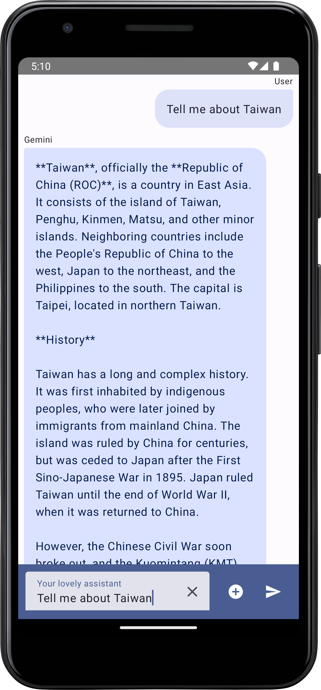
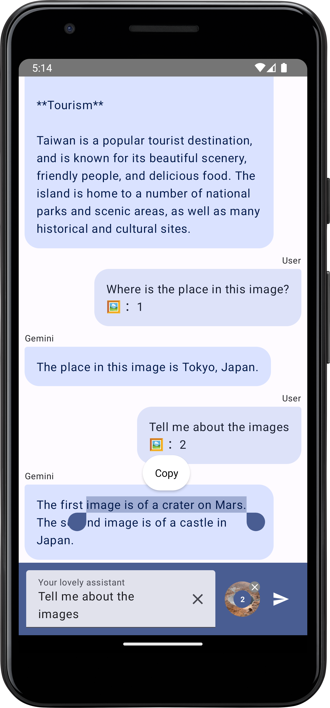
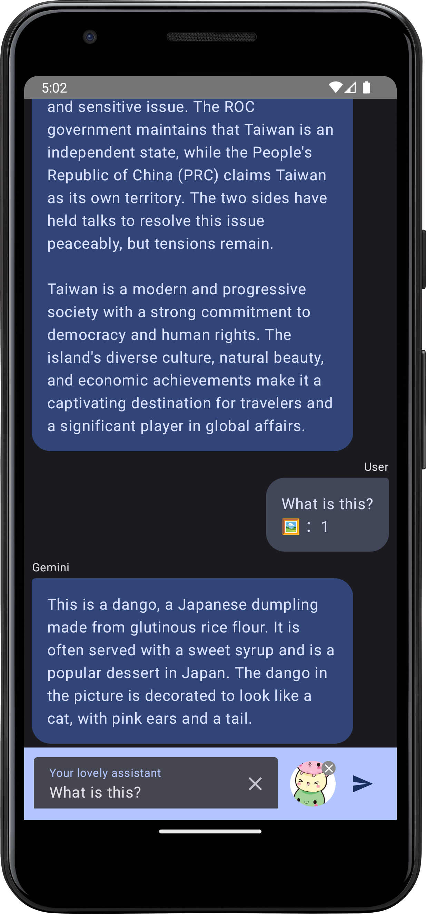

# Not Good to fork other people's original repo without leaving a star and following the author. - [Levi Lin (Author of this repo)](https://github.com/gy6543721)

# Gemini Android


Gemini Android App written in Kotlin and Compose.  
Now support English, Japanese, Traditional Chinese, Simplified Chinese and Cantonese, will support more languages in the future.  

## Introduction
Please add your own API key into `local.properties` after cloning this app.  
You can get Gemini API key [here](https://ai.google.dev/).  

```
apiKey=[your api key]
```
## Screenshots

Text | Image
:--: | :--:
 | 
 | 
